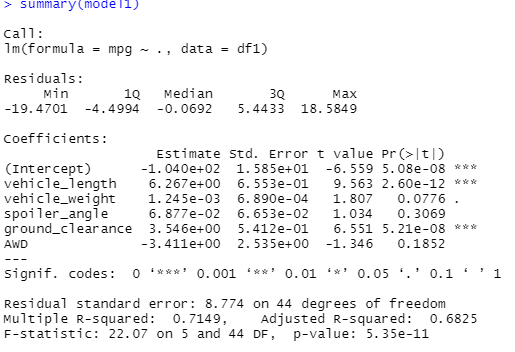
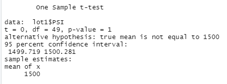
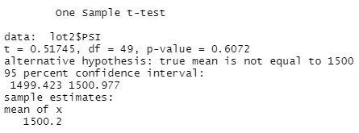
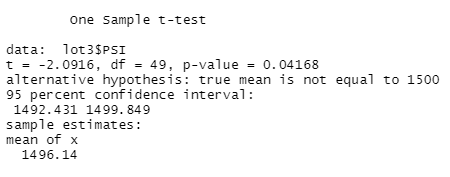

# MechaCar_Statistical_Analysis

## Linear Regression to Predict MPG

- Which variables/coefficients provided a non-random amount of variance to the mpg values in the dataset?

vehicle_length and ground_clearance provided a non-random amount of variance to the mpg values in the dataset, because the p-value is less than 0.05.

- Is the slope of the linear model considered to be zero? Why or why not?

The p-value is 5.35e-11, which is less than 0.05 and statistically significant. So, we can reject our null hypothesis, which means that the slope of our linear model is not zero.

- Does this linear model predict mpg of MechaCar prototypes effectively? Why or why not?

Since most of the variables in predicting the mpg of MechaCar prototypes have p-value that is greater than 0.05,
which means these variables are not statistically significant. Therefore, this linear model does not predict the MPG
of MechaCar prototypes effectively.

## Summary Statistics on Suspension Coils

- total_summary

- lot_summary

Since the design specifications for the MechaCar suspension coils dictate that the variance of the suspension coils must not exceed 100 pounds per square inch, and the current manufacturing data overall meets this design specification because the variance is less than 100. However, the lot3 does not meet this specification since its variance is greater than 100.

## T-Tests on Suspension Coils
- lot 1

H0: the mean of PSI for lot1 is 1500

H1: the mean of PSI for lot1 is not 1500

Since the p-value is greater than 0.05, it is not statistically significant. We do not have enough evidence to say that the the mean of PSI for lot1 is not 1500.Because the PSI for lot1 is not statistically different from the population mean of 1,500 pounds per square inch.

- lot 2

H0: the mean of PSI for lot2 is 1500

H1: the mean of PSI for lot2 is not 1500

Since the p-value is greater than 0.05, it is not statistically significant. We do not have enough evidence to say that the the mean of PSI for lot2 is not 1500. Because the PSI for lot2 is not statistically different from the population mean of 1,500 pounds per square inch.

- lot 3

H0: the mean of PSI for lot3 is 1500

H1: the mean of PSI for lot3 is not 1500

Since the p-value is greater than 0.05, it is not statistically significant. We have enough evidence to say that the the mean of PSI for lot3 is not 1500. Because the PSI for lot3 is statistically different from the population mean of 1,500 pounds per square inch.

## Study Design: MechaCar vs Competition

- What metric or metrics are you going to test?

  For me, I will test safety rating

- What is the null hypothesis or alternative hypothesis?

H0: The fuel efficiency is the same for all car manufacturers
Ha: At least one manufacturers have different fuel efficiency from others.

- What statistical test would you use to test the hypothesis? And why?

I will use ANOVA test, because the data of cars from multiple manufacturers will be collected.

- What data is needed to run the statistical test?

The safety rating data from different manufacturers are required to be collected.
